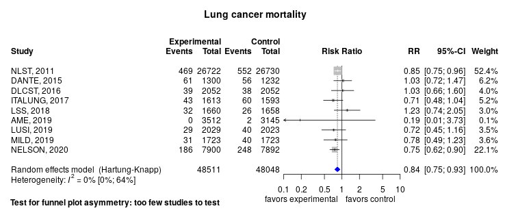
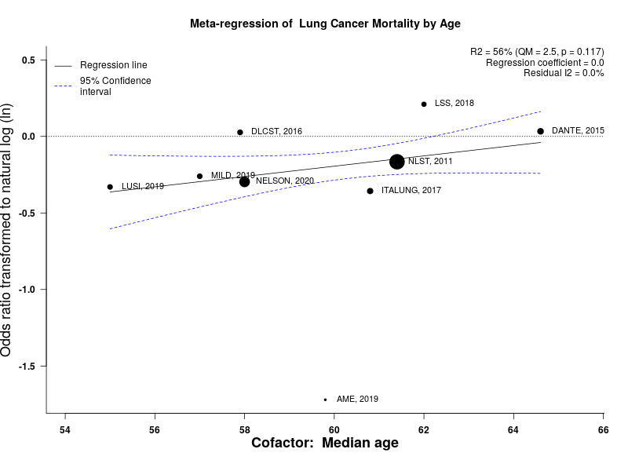

Lung cancer screening with low-dose computed tomography
============================================
A living systematic review

Short url: http://openmetaanalysis.github.io/lung-cancer-screening

**Clinical summary:** This meta-analysis suggests that clinical intervention *is not* effective. However, heterogeneity of results as measured by I2 was '[substantial](http://handbook-5-1.cochrane.org/chapter_9/9_5_2_identifying_and_measuring_heterogeneity.htm)' at 61%. This review updates previously published meta-analysis(es).(citation[s] below)

Meta-regression of common modulators (year of publication, study size, event rate in the control groups) as well as the number of rounds of screening, find that the outcome of the intervention is effected by these factors.
* [Reconciliation of conclusions with prior meta-analyses](files/reconciliation-tables/Reconciliation%20of%20conclusions.pdf) (under construction)
* [Keep current with this topic](files/searching/Keep-up.md) (under construction)

Acknowledgement: we acknowledge the essential work by the authors of the prior systematic review(s) listed below.

**Methods overview:** This repository is an [openMetaAnalysis](https://openmetaanalysis.github.io/) that combines methods of scoping, rapid, and living systematic reviews.  This analysis updates one or more previously published review(s) below. A comparison of studies included in this review compared to prior reviews are in the table, [reconciliation of trials included with prior meta-analyses/](files/reconciliation-tables/Reconciliation%20of%20studies.pdf). Newer studies included are listed in the references below. Rationale for newer trials excluded may be listed at the end of the references. 
* [Methods](http://openmetaanalysis.github.io/methods.html) for openMetaAnalysis
* [Evidence search](files/searching/evidence-search.md) for this review (under construction)

**Results:** Details of the studies included are in the:
* [Reconciliation of trials included with prior meta-analyses/](files/reconciliation-tables/Reconciliation%20of%20studies.pdf) (under construction)
* [Description of studies (PICO table)](files/study-details/table-pico.pdf) (under construction)
* [Risk of bias assessment](files/study-details/table-bias.pdf) (under construction)
* [Forest plots](../master/files/forest-plots) ([source data](files/data))
* [Network plots](../master/files/network) (optional)
* [Reconciliation of conclusions with prior meta-analyses](files/reconciliation-tables/Reconciliation%20of%20conclusions.pdf) (under construction)

The forest plot for the primary outcomes are below. Additional [forest plots](files/forest-plots) of secondary analyses may be available. 

The meta-regression for the primary outcomes are below. Additional [meta-regressions](files/metaregression) of secondary analyses may be available. 

References:
----------------------------------

### Systematic review(s)
#### Most recent review at time of last revision of this repository 
1. Snowsill T, Yang H, Griffin E, Long L, Varley-Campbell J, Coelho H, Robinson S, Hyde C. Low-dose computed tomography for lung cancer screening in high-risk populations: a systematic review and economic evaluation. Health Technol Assess.  2018 Nov;22(69):1-276. doi: 10.3310/hta22690. PMID: [30518460](http://pubmed.gov/30518460)
2. Coureau G, Salmi LR, Etard C, Sancho-Garnier H, Sauvaget C, Mathoulin-Pélissier S. Low-dose computed tomography screening for lung cancer in populations highly exposed to tobacco: A systematic methodological appraisal of published randomised controlled trials. Eur J Cancer. 2016 Jul;61:146-56. doi: 10.1016/j.ejca.2016.04.006. PMID: [27211572](http://pubmed.gov/27211572)
3. Manser R, Lethaby A, Irving LB, Stone C, Byrnes G, Abramson MJ, Campbell D. Screening for lung cancer. Cochrane Database Syst Rev. 2013 Jun 21;(6):CD001991. doi: 10.1002/14651858.CD001991.pub3. PMID: [23794187](http://pubmed.gov/23794187)

### Randomized controlled trials
#### New trial(s) *not* included in the most recent review above
1. Paci E, Puliti D, Lopes Pegna A, Carrozzi L, Picozzi G, Falaschi F, Pistelli F, Aquilini F, Ocello C, Zappa M, Carozzi FM, Mascalchi M; the ITALUNG Working Group. Mortality, survival and incidence rates in the ITALUNG randomised lung cancer screening trial. Thorax. 2017 Sep;72(9):825-831. doi: 10.1136/thoraxjnl-2016-209825. PMID: [28377492](http://pubmed.gov/28377492)

#### Trial(s) included in the review above
1. Wille MM, Dirksen A, Ashraf H, Saghir Z, Bach KS, Brodersen J, Clementsen PF, Hansen H, Larsen KR, Mortensen J, Rasmussen JF, Seersholm N, Skov BG, Thomsen LH, Tønnesen P, Pedersen JH. Results of the Randomized Danish Lung Cancer Screening Trial with Focus on High-Risk Profiling. Am J Respir Crit Care Med. 2016 Mar 1;193(5):542-51. doi: 10.1164/rccm.201505-1040OC. PMID: [26485620](http://pubmed.gov/26485620)
2. Becker N, Motsch E, Gross ML, Eigentopf A, Heussel CP, Dienemann H, Schnabel PA, Eichinger M, Optazaite DE, Puderbach M, Wielpütz M, Kauczor HU, Tremper J, Delorme S. Randomized Study on Early Detection of Lung Cancer with MSCT in Germany: Results of the First 3 Years of Follow-up After Randomization. J Thorac Oncol. 2015 Jun;10(6):890-6. doi: 10.1097/JTO.0000000000000530. PMID: [25783198](http://pubmed.gov/25783198)
3. Infante M, Cavuto S, Lutman FR, Passera E, Chiarenza M, Chiesa G, Brambilla G, Angeli E, Aranzulla G, Chiti A, Scorsetti M, Navarria P, Cavina R, Ciccarelli M,  Roncalli M, Destro A, Bottoni E, Voulaz E, Errico V, Ferraroli G, Finocchiaro G,  Toschi L, Santoro A, Alloisio M; DANTE Study Group. Long-Term Follow-up Results of the DANTE Trial, a Randomized Study of Lung Cancer Screening with Spiral Computed Tomography. Am J Respir Crit Care Med. 2015 May 15;191(10):1166-75. doi: 10.1164/rccm.201408-1475OC. PMID: [25760561](http://pubmed.gov/25760561)
4. Black WC, Gareen IF, Soneji SS, Sicks JD, Keeler EB, Aberle DR, Naeim A, Church TR, Silvestri GA, Gorelick J, Gatsonis C; National Lung Screening Trial Research Team. Cost-effectiveness of CT screening in the National Lung Screening  Trial. N Engl J Med. 2014 Nov 6;371(19):1793-802. doi: 10.1056/NEJMoa1312547. PMID: [25372087](http://pubmed.gov/25372087)

#### Trial(s) undergoing review
None

#### Trial(s) excluded - selected list of important trial(s)
1. Pastorino U, Rossi M, Rosato V, Marchianò A, Sverzellati N, Morosi C, Fabbri A, Galeone C, Negri E, Sozzi G, Pelosi G, La Vecchia C. Annual or biennial CT screening versus observation in heavy smokers: 5-year results of the MILD trial. Eur J Cancer Prev. 2012 May;21(3):308-15. doi: 10.1097/CEJ.0b013e328351e1b6. PMID: [22465911](http://pubmed.gov/22465911) *Excluded on the basis of concerns expressied in the HTA systematic review (Snowsill).*

#### Cited by
This repository is cited by:

1. WikiDoc contributors. Pending content page. WikiDoc. Nov 9, 2014. Available at: http://www.wikidoc.org/index.php/This_topic. Accessed November 9, 2014. 

-------------------------------
[Cite and use this content](https://github.com/openMetaAnalysis/openMetaAnalysis.github.io/blob/master/reusing.MD)  - [Edit this page](../../edit/master/README.md) - [License](files/LICENSE.md) - [History](../../commits/master/README.md)  - 
[Issues and comments](../../issues?q=is%3Aboth+is%3Aissue)

